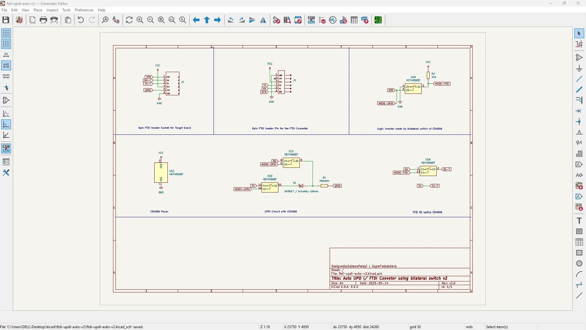
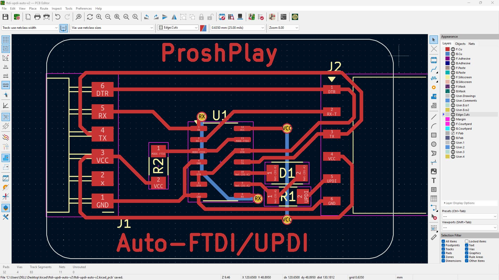
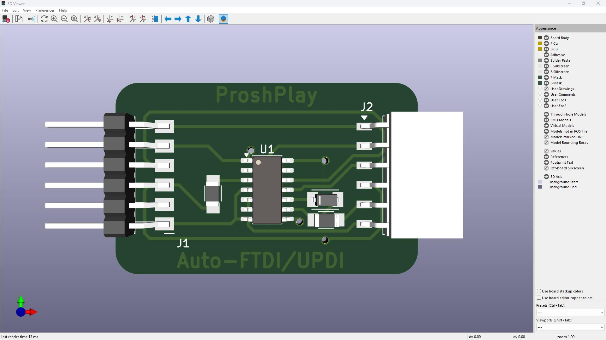

# ProshPlay_Auto_UPDI-FTDI_Converter
At last I found the circuit that I'm looking for to make my own automatic FTDI and UPDI converter
## Overview
I've been trying to make an unified programer for the AVR series 1 and Series 2 microcontrollers which uses the single UPDI pin for programming. and we can create the UPDI programer by adding a simple resistor to an existing USB to FTDI or UART converter available in the market. but that to read serial we need another FTDI or we need to switch the converter and the programer board back in forth while programming  

## Schematic

## PCB Layout

## 3D PCB 

## Reference
- 